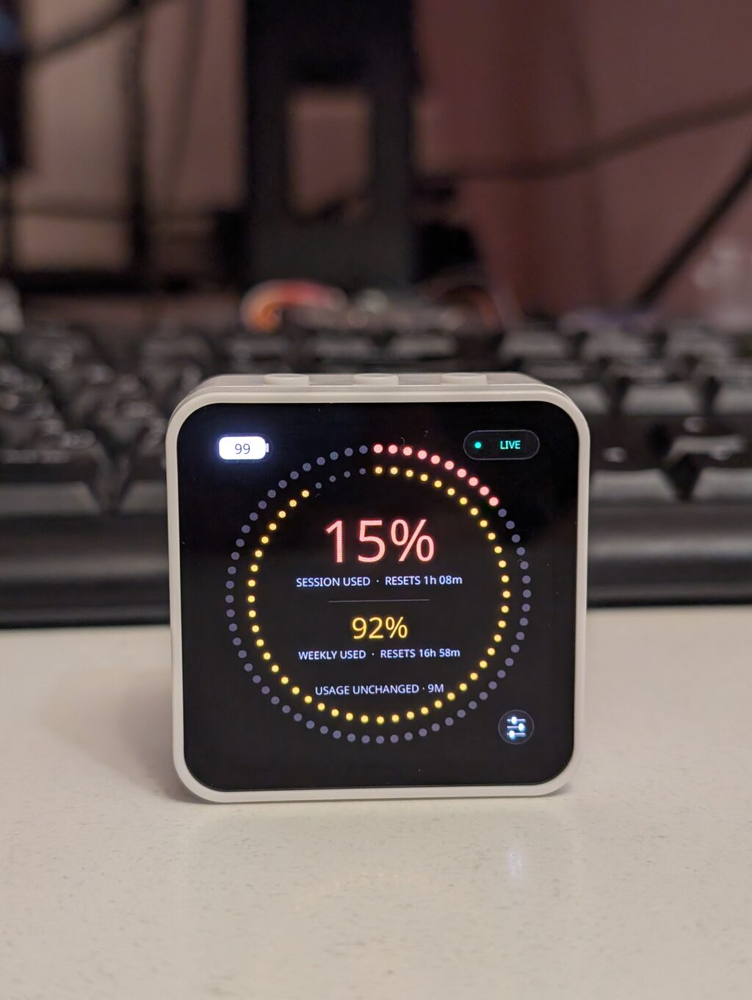

# Claudial

Claudial is a desk display for Claude subscription usage. It shows the current
five-hour and seven-day utilization, reset times, spending pace, data freshness,
and battery state on a [Waveshare ESP32-S3-Touch-AMOLED-2.16][board-docs].

<p align="center">
  
</p>

The display does not hold Claude credentials or access the network. A small
Linux user service obtains usage, finds the display over BLE, synchronizes its
RTC, and sends a fresh snapshot once a minute.

## Requirements

- The Waveshare board connected over its USB-JTAG port for flashing.
- Rust, the `esp` toolchain installed by [espup], and `probe-rs`.
- A Linux host with BlueZ that remains near the display.
- Either Claude Code logged in on that host, or access to a
  [claude-proxy-rs][proxy] instance.

## Flash the display

The firmware has its own toolchain and Cargo configuration, so build it from
inside `firmware/`:

```sh
cd firmware
cargo build --release
probe-rs download --chip esp32s3 --preverify --verify --reset \
  target/xtensa-esp32s3-none-elf/release/claudial-firmware
cd ..
```

This is needed for initial installation and after firmware changes. During
firmware development, `cargo run --release` additionally attaches RTT logging;
disconnect the probe before evaluating BLE stability.

## Install the host service

Build only the daemon, install it for the current user, and enable the supplied
systemd unit:

```sh
cargo build --release -p claudial-host
install -Dm755 target/release/claudial-host ~/.local/bin/claudial-host
install -Dm644 systemd/claudial-host.service \
  ~/.config/systemd/user/claudial-host.service
systemctl --user daemon-reload
systemctl --user enable --now claudial-host.service
```

The service starts with the user session, reconnects automatically when the
display returns, and keeps all credentials on the host.

### Choose the usage source

`claude-code` is the default. It rereads Claude Code's rotating credential from
`~/.claude/.credentials.json` and makes one minimal Anthropic request per
minute while the display is connected, using only its rate-limit headers.

`claude-proxy` instead reads the snapshot already cached by
`claude-proxy-rs`. On Plasma it reuses the proxy URL, username, and password
stored by [claude-plasmoid][plasmoid] in KWallet, without creating another copy
of the admin password.

To use it for the service, create the override directory:

```sh
mkdir -p ~/.config/systemd/user/claudial-host.service.d
```

Then save the following as
`~/.config/systemd/user/claudial-host.service.d/usage-source.conf`:

```ini
[Service]
Environment=CLAUDIAL_USAGE_SOURCE=claude-proxy
```

Then apply the override:

```sh
systemctl --user daemon-reload
systemctl --user restart claudial-host.service
```

For foreground or non-Plasma use, the same source accepts
`CLAUDIAL_PROXY_URL`, `CLAUDIAL_PROXY_USERNAME`, and
`CLAUDIAL_PROXY_PASSWORD` when all three are set. The source can also be
selected for a foreground run with
`claudial-host --usage-source claude-proxy`.

## Operation

```sh
systemctl --user status claudial-host.service
journalctl --user -u claudial-host.service -f
systemctl --user restart claudial-host.service
```

To update the daemon after pulling changes, rebuild `claudial-host`, reinstall
the binary, and restart the service. Reflash the board only when the firmware
has changed.

## Repository layout

- `firmware/` — ESP32-S3 firmware and Slint UI.
- `claudial-host/` — Linux BLE and usage daemon.
- `claudial-icd/` — shared wire types, display settings, and pace calculation.

Claudial was inspired by [Clawdmeter][clawdmeter], but is an independent
implementation and does not reuse its artwork.

[board-docs]: https://docs.waveshare.com/ESP32-S3-Touch-AMOLED-2.16
[clawdmeter]: https://github.com/HermannBjorgvin/Clawdmeter
[espup]: https://github.com/esp-rs/espup
[plasmoid]: https://github.com/okhsunrog/claude-plasmoid
[proxy]: https://github.com/okhsunrog/claude-proxy-rs
